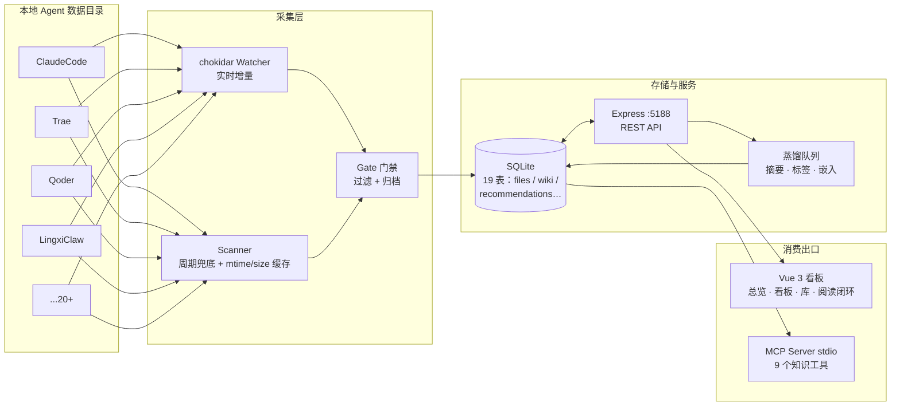

# AgentFeed

> 抓取本地 AI Agent 的工作产物，汇总、分拣为热知识缓存，按需蒸馏后供任意 Agent 消费。


AgentFeed 把散落在各个 AI Agent 数据目录（Claude Code、Trae、Qoder、Coze、Workbuddy……）里的
Markdown / HTML 产物统一采集入库为**热知识缓存**：经**门禁过滤 → 领域分拣**完成分拣入库，**LLM 蒸馏**按队列增量补充摘要/标签等增强信息，Wiki 词条支持导入挂载，
最终通过 **Web 看板** 与 **MCP Server** 双出口，供人和任意 Agent 按关键词（LIKE）检索消费。
与 DataMind 类 data plane 错位竞争：data plane 管**会话内记忆**（边聊边写、下一句即用）；
AgentFeed 管**跨项目阅历**——自动捕获 Agent 工作排放物，经门禁与蒸馏沉淀，跨会话持续复利。
采集与存储全部在本机完成；LLM 环节默认未启用，启用后仅发往你自行配置的服务商——外发边界见下方[「数据与隐私边界」](#-数据与隐私边界)一节。

---

## ✨ 功能特性

- **🔌 多 Agent 自动接入** — 内置 20+ 主流 Agent 数据目录探测（ClaudeCode / Trae / Qoder / LingxiClaw / Coze / DoubaoWork / QwenWork / Cursor / CodexCLI…），一键挂载为扫描根
- **📡 实时 + 周期双通道采集** — chokidar watcher 秒级响应文件新增/变更/删除；启动兜底 + 每 30 分钟周期增量扫描，补齐停机窗口
- **⚡ mtime+size 缓存快路径** — 未变更文件免读盘、免哈希、免门禁重评，万级文件重扫从 22s 降至 2s
- **🚧 内容门禁** — 体积/内容规则过滤低质文件，skipped 记录按月归档 CSV，支持白名单与手动恢复豁免
- **🗂 领域分拣** — 树形领域体系（支持父子级联），文件按领域归类，配色贯穿全站
- **🧠 LLM 蒸馏管线** — 队列化蒸馏（摘要/标签/实体/要点/关系），嵌入向量 + 规则评分双排序，失败自动重试回填
- **📊 调度总览 + 数据看板** — 双 Tab 看板：今日流量/趋势/来源占比一屏尽览；Agent 生产卡可下钻二级目录，领域占比以彩色气泡图呈现
- **📚 阅读推荐闭环** — 规则分 + LLM 质量分双排序推荐池，每日精选零成本轮转；阅读进度手动挡 + 滚动自动记录，续读自动回位；两维打分入执行队列，周目标环与薄弱领域/停滞提示复盘
- **📖 站内阅读器** — md/html 沙箱渲染（双保险：服务端白名单清洗 + iframe 禁脚本，内容零脚本执行），目录侧栏、字号与夜间主题，图片资源经扫描根边界代理
- **🔗 MCP Server** — stdio 方式暴露 `search_knowledge` / `read_entry` / `stats` / `getContext` / `get_user_context` 等 9 个工具，Trae / Claude Desktop / Cursor 直接挂载

## 🏗 架构



## 🚀 快速开始

环境要求：**Node.js ≥ 20**、macOS（依赖 `lsof` 管理端口）。

```bash
# 1. 安装依赖（npm workspaces：server + web）
npm install

# 2. 一键启动（缺构建产物时自动构建前后端）
./service.sh start

# 3. 打开看板
open http://127.0.0.1:5188
```

常用命令：

| 命令 | 说明 |
| --- | --- |
| `./service.sh start` | 启动服务（自动构建缺失产物） |
| `./service.sh restart` | 重建前后端并重启 |
| `./service.sh status` / `logs` | 查看状态 / 跟踪日志 |
| `./service.sh build` | 强制重新构建 |
| `npm test -w server` | 运行后端测试 |

## 📖 阅读闭环

1. **供给页**：从推荐池选文（每日精选自动置顶于总览页），25/50/75/100% 快捷挡记进度，或点「站内读」进入阅读器
2. **站内阅读器**：滚动自动记进度，中途退出再进自动回位到上次位置；读毕 100% 提示打分
3. **打分**：两维打分 10 秒完成（弹层预填当前进度），值得实操的进入总览页执行队列
4. **复盘**：周卡展示目标完成环（目标可在线修改）、薄弱领域与在读停滞（>14 天未更新）提示

## 🔌 Agent 目录接入

进入看板 **扫描页**，Agent 探测卡会列出本机已识别的 Agent 目录，点击即挂载为扫描根。
内置识别列表见 [`server/src/agents.ts`](server/src/agents.ts)，支持 home 下多候选路径，
新增自定义 Agent 只需追加一行：

```ts
{ name: 'MyAgent', candidates: ['.my-agent', 'Documents/MyAgent'] }
```

挂载后自动触发全量扫描并纳入 watcher / 30 分钟周期增量扫描，无需其他配置。

## 🧩 MCP 挂载

以 stdio 方式运行，供任意支持 MCP 的 Agent 挂载（完整说明见 [MCP_SETUP.md](MCP_SETUP.md)）：

```json
{
  "mcpServers": {
    "agentfeed-knowledge": {
      "command": "npm",
      "args": ["run", "mcp"],
      "cwd": "<AgentFeed 仓库路径>/server"
    }
  }
}
```

暴露工具：`search_knowledge` · `read_entry` · `get_source` · `list_domains` · `list_agents` · `list_tags` · `stats` · `getContext`（领域开工上下文）· `get_user_context`（用户画像）——详见 [MCP_SETUP.md](MCP_SETUP.md)

## 📁 目录结构

```
AgentFeed/
├── service.sh            # 一键启停/构建脚本（端口 5188）
├── server/               # Express + SQLite 后端
│   ├── src/routes/       #   REST API（files/reading/recommend/scan/stats/llm/wiki…）
│   ├── src/llm/          #   蒸馏队列 / 嵌入 / 清洗 / 标签治理
│   ├── src/reader.ts     #   站内阅读器管线（渲染/白名单清洗/TOC/图片代理）
│   ├── src/ruleScore.ts  #   规则评分引擎
│   ├── src/opener.ts     #   外部打开（扫描根边界校验）
│   ├── src/scanner.ts    #   扫描器（门禁 + mtime/size 缓存）
│   ├── src/watcher.ts    #   chokidar 实时监听
│   ├── src/agents.ts     #   KNOWN_AGENTS 目录映射
│   └── test/             #   node:test 单元测试（含阅读器安全用例）
├── web/                  # Vue 3 + Vite 前端看板
│   └── src/views/        #   总览 / 看板 / 库 / 分拣 / 管线 / 供给 / 阅读 / 设置
└── docs/                 # 设计文档（阅读闭环 PRD · 阅读器 PRD · 门禁设计）
```

## 🛡 数据与隐私边界

AgentFeed 自身不内置任何云端依赖、无遥测上报；但**扫描根内入库的内容会在下列环节被送往你在设置页自行配置的 LLM 服务商**。服务商完全由你决定（预设均为 OpenAI 兼容接口，含本地 Ollama——只配 Ollama 即可全本地零外发；不配置任何服务商则所有 LLM 环节静默跳过）。

| 环节 | 外发内容 | 触发时机 |
| --- | --- | --- |
| 蒸馏（wiki 词条生成） | 文件头部 ≤512KB 原文（>100KB 自动降为 4000 字摘要）；API Key / 密码 / Bearer 令牌等常见密钥形态已正则脱敏；视觉模型另附文档内嵌图片 ≤3 张（仅限扫描根内） | 文件过门禁入库后自动入队 |
| 推荐语 / 质量分 / 批量策展 | 标题 + 原文开头 1500 字符（脱敏后）；批量策展只送 30 篇的标题 / 领域 / 摘要片段 | 推荐语随入池自动；补分与策展为手动触发 |
| 向量化（embedding） | 标题 + LLM 摘要；wiki 词条（LLM 产物）按标题分块的文本 | 蒸馏成功后自动；需先在设置中启用嵌入模型 |
| 语义检索 | 你输入的检索词 | 使用语义 / 向量检索时 |
| 标签治理 | 标签名与使用次数（不含文件正文） | 设置页手动启动语义归组 / 分级扫描 |
| 用户画像蒸馏 | 30 天聚合统计 + 标签权重 + 上版画像断言（**不含任何原始阅读 / 对话内容**） | 月频信号累积触发，可整体关闭 |
| 对话问答 I1 | 用户提问 + 检索摘要上下文 + 领域陪练官 system prompt（复盘另发该会话全部消息记录） | 使用对话功能时 |

- **门禁过滤是纯本地规则**（大小 / 字符数 / 代码占比 / 黑白名单），不外发任何内容，也没有 LLM 语义判定调用
- **不希望外发的内容**：到设置页「过滤门禁 → 排除目录」配置，命中即完全不入库，自然不会被任何 LLM 环节处理
- 画像蒸馏可通过 `userProfile.enabled` 关闭，向量化可通过 `ai.embedding.enabled` / `search.vectorEnabled` 关闭
- 逐链路代码位置与核实依据见 [docs/privacy-boundary.md](docs/privacy-boundary.md)

## 🔒 隐私与安全

- **本体零联网**：采集、存储、检索全部在本地完成，无任何遥测；LLM 环节仅在你自行配置服务商后启用（外发内容见上方「数据与隐私边界」）
- **密钥不入库**：API Key 仅存于本地 `server/data/`（已 gitignore）；仓库不含任何 `.env`、数据库、日志与压缩包
- **MCP 仅 stdio**：知识工具通过标准输入输出通信，不监听任何网络端口

## License

MIT
