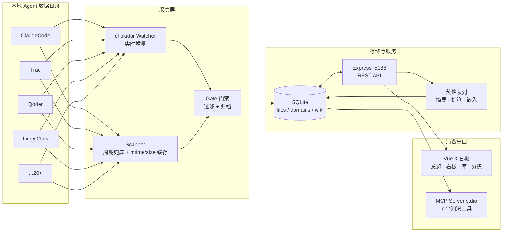

# AgentFeed

> 抓取本地 AI Agent 的工作产物，汇总、分拣、蒸馏成知识，再供给任意 Agent 消费。


AgentFeed 把散落在各个 AI Agent 数据目录（Claude Code、Trae、Qoder、Coze、Workbuddy……）里的
Markdown / HTML 产物统一采集入库：经过**门禁过滤 → 领域分拣 → LLM 蒸馏 → Wiki 沉淀**，
最终通过 **Web 看板** 与 **MCP Server** 双出口，供人和任意 Agent 检索消费。
所有数据仅在本机流转，不出网关。

---

## ✨ 功能特性

- **🔌 多 Agent 自动接入** — 内置 20+ 主流 Agent 数据目录探测（ClaudeCode / Trae / Qoder / LingxiClaw / Coze / DoubaoWork / QwenWork / Cursor / CodexCLI…），一键挂载为扫描根
- **📡 实时 + 周期双通道采集** — chokidar watcher 秒级响应文件新增/变更/删除；启动兜底 + 每 30 分钟周期增量扫描，补齐停机窗口
- **⚡ mtime+size 缓存快路径** — 未变更文件免读盘、免哈希、免门禁重评，万级文件重扫从 22s 降至 2s
- **🚧 内容门禁** — 体积/内容规则过滤低质文件，skipped 记录按月归档 CSV，支持白名单与手动恢复豁免
- **🗂 领域分拣** — 树形领域体系（支持父子级联），文件按领域归类，配色贯穿全站
- **🧠 LLM 蒸馏管线** — 队列化蒸馏（摘要/标签/实体/要点/关系），嵌入向量 + 规则评分双排序，失败自动重试回填
- **📊 调度总览 + 数据看板** — 双 Tab 看板：今日流量/趋势/来源占比一屏尽览；Agent 生产卡可下钻二级目录，领域占比以彩色气泡图呈现
- **🔗 MCP Server** — stdio 方式暴露 `search_knowledge` / `read_entry` / `stats` 等 7 个工具，Trae / Claude Desktop / Cursor 直接挂载

## 🏗 架构



## 🚀 快速开始

环境要求：**Node.js ≥ 20**、macOS（依赖 `lsof` 管理端口）。

```bash
# 1. 安装依赖（npm workspaces：server + web）
npm install

# 2. 一键启动（缺构建产物时自动构建前后端）
./service.sh start

# 3. 打开看板
open http://127.0.0.1:5188
```

常用命令：

| 命令 | 说明 |
| --- | --- |
| `./service.sh start` | 启动服务（自动构建缺失产物） |
| `./service.sh restart` | 重建前后端并重启 |
| `./service.sh status` / `logs` | 查看状态 / 跟踪日志 |
| `./service.sh build` | 强制重新构建 |
| `npm test -w server` | 运行后端测试 |

## 🔌 Agent 目录接入

进入看板 **扫描页**，Agent 探测卡会列出本机已识别的 Agent 目录，点击即挂载为扫描根。
内置识别列表见 [`server/src/agents.ts`](server/src/agents.ts)，支持 home 下多候选路径，
新增自定义 Agent 只需追加一行：

```ts
{ name: 'MyAgent', candidates: ['.my-agent', 'Documents/MyAgent'] }
```

挂载后自动触发全量扫描并纳入 watcher / 30 分钟周期增量扫描，无需其他配置。

## 🧩 MCP 挂载

以 stdio 方式运行，供任意支持 MCP 的 Agent 挂载（完整说明见 [MCP_SETUP.md](MCP_SETUP.md)）：

```json
{
  "mcpServers": {
    "agentfeed-knowledge": {
      "command": "npm",
      "args": ["run", "mcp"],
      "cwd": "<AgentFeed 仓库路径>/server"
    }
  }
}
```

暴露工具：`search_knowledge` · `read_entry` · `get_source` · `list_domains` · `list_agents` · `list_tags` · `stats`

## 📁 目录结构

```
AgentFeed/
├── service.sh            # 一键启停/构建脚本（端口 5188）
├── server/               # Express + SQLite 后端
│   ├── src/routes/       #   REST API（files/domains/scan/stats/llm/wiki…）
│   ├── src/llm/          #   蒸馏队列 / 嵌入 / 清洗 / 标签治理
│   ├── src/scanner.ts    #   扫描器（门禁 + mtime/size 缓存）
│   ├── src/watcher.ts    #   chokidar 实时监听
│   ├── src/agents.ts     #   KNOWN_AGENTS 目录映射
│   └── test/             #   node:test 单元测试
├── web/                  # Vue 3 + Vite 前端看板
│   └── src/views/        #   总览 / 看板 / 库 / 分拣 / 管线 / 供给 / 设置
└── docs/                 # 设计文档
```

## 🔒 隐私与安全

- **数据不出本机**：采集、存储、蒸馏、检索全部在本地完成；LLM 蒸馏仅在你于设置页自行配置 API Key 后启用
- **密钥不入库**：API Key 仅存于本地 `server/data/`（已 gitignore）；仓库不含任何 `.env`、数据库、日志与压缩包
- **MCP 仅 stdio**：知识工具通过标准输入输出通信，不监听任何网络端口

## License

MIT
