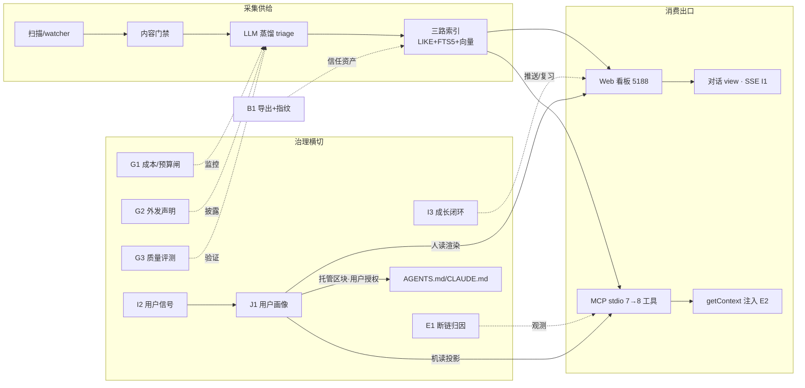
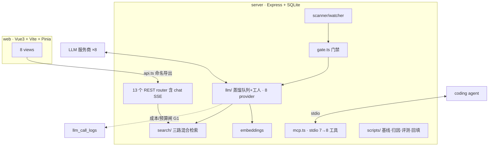
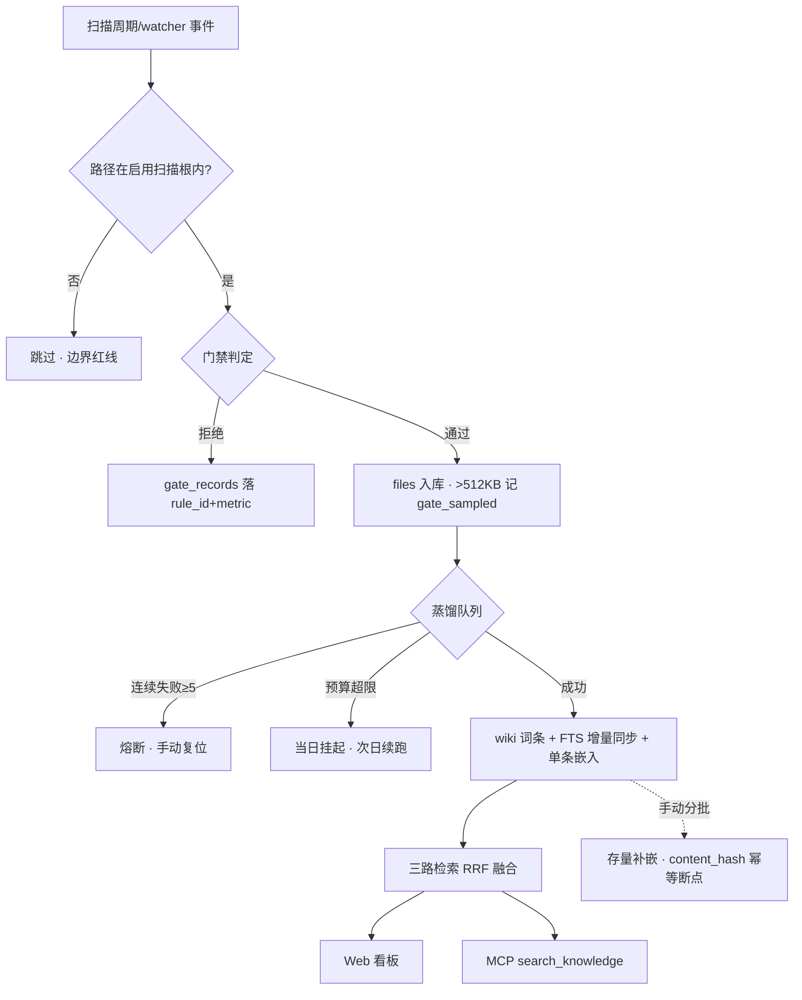

# AgentFeed v0.1.5 PRD —— 供给优先 × AI Native 大版本：让 Agent 与人更好地读、更好地用

> 版本：v2.3（增补用户画像 J 类——AI Native 完整体） | 日期：2026-09-21 | 状态：**PROPOSED（持续修订中）**
> 上游版本：v0.1.0 | 版本性质：供给优先 × **AI Native 完整体**（用户裁决 2026-09-21 三次）——「让 Agent 与人更好地读、更好地用」，且「让 LLM 可计费、可审计、可证明、越用越懂用户」
> 依据：DataMind × AgentFeed 横纵分析报告 + Wave 3 检索基线验收 + 双消费者出口设计（APPROVED）+ AI Native 架构文章 + 14 问 14 答用户裁决 + AI Native 边界能力盘点
> 方向与治理见 `iteration-roadmap-2026Q4.md` §5~§7；本 PRD 可持续修订（ARCHIVED 纪律已按用户裁决废除）

## 第 1 章 · 产品概述与目标

### 1.1 背景与痛点

AI Agent 的日常产物（代码、文档、报告）散落在各项目目录，跨项目无法复用——上一个项目踩过的坑、写过的方案，下一个项目一无所知。v0.1.0 已交付「采集 → 门禁 → 分拣 → LLM 蒸馏 → Web 看板 + MCP 双出口」骨架与阅读闭环（M1~M5）、站内阅读器（R4），但检索三路瘸两路（FTS 覆盖 5.2%、向量为空）、agent 消费链路断链（search→read 跟随率 0%）、LLM 成本与外发边界不可见。v0.1.5 = 收敛落袋 + 补全地基 + 打通消费主动端 + 建立 AI Native 边界。

### 1.2 产品定位

本地优先的 Agent 产物知识库：自动捕获、门禁蒸馏、跨项目复利——「热知识缓存 + 按需蒸馏」，不做会话内记忆。人侧经对话桥梁与 RSI 成长闭环消费同一语料（用户裁决 2026-09-21）。

### 1.3 核心目标（基线 → 目标）

1. 检索命中率：基线重放 Top-3 命中 66.7%（三路补全后维持不劣化，向量路就绪后复测上行）
2. 消费与理解闭环：agent 侧 level1 归因成文 + args 落库率 100%；人侧对话桥梁 + 用户理解信号（I 类）；**用户画像让产品越用越懂用户角色与倾向（J 类，2026-09-21 三次裁决）**
3. LLM 边界三属性：成本不可见 → 金额+预算闸；外发不透明 → 成文声明；质量不可证 → golden set 数字

### 1.4 成功指标

见第 10 章版本级验收（10.2 发布门槛 11 条 + 2 条跨版本观察项）。

### 1.5 竞品与差异化

| 竞品 | 类型 | 核心功能与需求设计要点 | 可借鉴 | 差异化点 |
|---|---|---|---|---|
| DataMind | 商业 | data plane 管会话内记忆：边聊边写、下一句即用；freeze/verify/SHA-256 信任资产叙事 | provenance 导出与内容指纹（→B1）；复利公式（沉淀率×转化率）作度量框架 | AgentFeed 管跨项目阅历：自动捕获排放物、门禁蒸馏、跨会话复利 |
| WeKnora | 开源 | 企业知识库 RAG 全家桶：多格式导入、检索问答、权限体系 | 检索基建工程化参考（FTS5+向量+融合） | 不做写入面/问答出口，消费端是 Agent（MCP）而非人侧问答 |
| （其余） | — | 无直接同位竞品（自动捕获 agent 产物 + MCP 出口组合为新品类） | — | 品类定义者位置 |

### 1.6 名词解释

| 术语 | 定义 |
|---|---|
| 供给优先 | 先做功能、打通链路，消费数据只伴随观测不门控（2026-09-21 用户裁决） |
| 三路检索 | LIKE + FTS5 trigram + 向量分块，RRF k=60 融合 |
| 断链归因 | level1 链路（search_knowledge → read_entry → get_source）完成率为 0 的原因四分类 |
| triage 蒸馏 | top 领域精选有限篇目蒸馏，预算上限 + 连续失败熔断（TRIAGE_FAIL_LIMIT=5） |
| corpusFingerprint | 语料指纹（filesCount/maxFileId + 逐词条 SHA-256），基线重放的语料锚点 |
| 聊天桥梁 | 看板「对话」view：人侧 SSE 流式问答出口，检索只读消费 wiki；角色/提示词/内置 skill 与领域和标签体系深度绑定（定制化做深为护城河）；第三方成熟 agent 经 MCP 消费为并存通道（原生优势 = 本地用户信号 + RSI + 领域定制角色） |
| RSI | 成长自驱闭环：基于用户理解信号主动规划学习/复习任务，依作答与反馈结果自我调整推送与复习间隔的正反馈循环（用户裁决 2026-09-21） |
| 文件关联度 | 短时间窗内被连续打开文件的会话聚类，度量主题簇与学习路径候选（驻留/滚动埋点经用户核实不可行，不采用） |
| user_profile | 用户画像表：以 domain 为容器、标签为偏好向量的结构化画像（scope global/domain + 断言列表 + evidence 证据指针 + 版本链），人读机读同源 |
| 画像断言 | 画像的最小单元 {claim, status, evidence[]}；status ∈ active（AI 生成生效）/ user_added（用户补充，蒸馏须保留）/ vetoed（用户否决，作下轮蒸馏负例） |
| 托管区块 | AGENTS.md/CLAUDE.md 中 `<!-- agentfeed:profile -->` 标记包裹的画像渲染区——幂等更新，区块外用户内容不动，是否写入由用户按项目授权 |
| H 类可选储备 | AI Native 边界能力其余五项，主项完成后按余力取，不阻塞发布 |
| 中立性宪法 | 本地优先 / 不绑厂商 / 单机可跑，三属性不得以磨损换便利（F4 裁决后接受外部 rerank，本地/单机不变） |
| 飞轮 | 消费信号回流排序/蒸馏的数据闭环，本版只出设计稿（D2），实现属 v0.2.x |

## 第 2 章 · 用户画像与场景

### 2.1 用户画像

单人开发者（项目作者本人）：重度 AI Agent 使用者，多项目并行，本地 macOS 环境，自付 LLM API 费用，追求可审计与可回滚。次级消费者 = 用户配置的 coding agent（通过 MCP 挂载）。

### 2.2 核心使用场景

1. 作为开发者，我希望 agent 产物自动入库蒸馏，以便我不做任何手工整理就有跨项目知识库
2. 作为 agent，我希望 search_knowledge 查准查全，以便开工时复用历史方案少踩坑（当前痛点：FTS/向量瘸腿）
3. 作为 agent，我希望 getContext 开工注入领域上下文，以便不必先知道要搜什么（E2）
4. 作为开发者，我希望看到 LLM 花了多少钱并设预算闸，以便全量蒸馏/嵌入前心里有数、跑超能拦住（G1）
5. 作为开发者，我希望明确知道哪些内容被送往第三方 LLM，以便放入私人/公司文档前做排除决策（G2）

### 2.3 使用频率与时长预估

常驻后台（service.sh 守护）；扫描周期默认 120 分钟（可配置）+ watcher 实时；agent 按任务触发 MCP 调用；人侧看板每日浏览数分钟 + 日报每日 1 次。嵌入补嵌为手动分批（每批词条默认 50，端到端约 12s/3 词条量级）。

## 第 3 章 · 功能模块与范围

### 3.1 范围边界

| 本次做什么 | 明确不做什么 | 留待后续迭代 |
|---|---|---|
| C3 工作树收敛提交 | recordSession 写回、人侧问答出口 | 「v0.1.5 之后重规划」池 |
| E1 断链归因诊断（含看板诊断面板） | 消费信号回流排序（本版只诊断不回流） | 飞轮 MVP（D2 设计稿先行） |
| A3+ 返回体可读性治理 | 对话写库/改检索排序（评分回流与 D2 合并裁决） | — |
| A2 嵌入手动分批补嵌（运营窗口） | G1 开跑前成本预估（token 量不可预估，假数字比不做更坏） | — |
| E2 getContext 注入（MCP 第 8 工具） | G2「入库但禁蒸馏」细粒度开关（目录级排除已覆盖，细粒度属投机设计） | triage pull 化 |
| G1 成本视图 + 日预算闸 | G3 LLM-as-judge 幻觉率/流畅度打分（二次成本+循环依赖） | recordSession 写回 |
| G2 外发隐私声明 | 库内语料破坏性清洗（治出口不治语料） | H 类五项（H1~H5，见 3.3.8） |
| G3 质量评测 golden set | — | — |
| B1 wiki 导出+指纹 / D1 评估闭环 / A4 收编验证 / C1 README 补句 / D2 设计稿 | — | — |
| I1 人侧对话桥梁（SSE）/ I2 用户理解信号 / I3 RSI 成长闭环（见 3.3.9） | 理解度检查默认关（opt-in）；评分回流排序与 D2 合并裁决 | 阅读器正文静态富化（TL;DR/术语脚注，P2 储备） |
| J1 画像存储与蒸馏 / J2 画像维护页 / J3 机读画像出口 B+C（见 3.3.10） | 未经用户授权向任何项目写 AGENTS.md/CLAUDE.md（同步权在用户） | 画像驱动检索排序（与 D2 合并裁决） |

### 3.2 模块总览

### 3.3 功能需求详述

> 优先级：P0 = 发布门槛组成；P1 = 随批交付；P2 = 可选储备。执行顺序（批次而非门槛）：第 0 批 C3 → 第 1 批 E1 → 第 2 批 A1（已完成）+A3 → 第 3 批 A2（已转运营）→ 第 4 批 E2 → 第 5 批 G2→G1→G3 → 第 6 批 I1→I2→I3（人侧 AI Native）→ 第 7 批 J1→J2→J3（用户画像，AI Native 完整体收官，2026-09-21 三次裁决）；随批 A4/B1/C1/D1；随时 D2/H 类。

#### 3.3.1 A 类：问题修复

**A1 FTS 存量回填（修 D1）— 已完成（方案变更后落地）** ｜ P0
- 前置条件：`wiki_fts` 2519 行 / `wiki_entries_meta` 48531 行，覆盖率 5.2%
- 实际落地方案（替代原「断点增量」设计）：`FTS_BACKFILL_CAP` 20000 → 200000 + 运维脚本 `server/scripts/ftsBackfill.ts` 全量重建；wiki_fts 2693 → 48705 行，与主表 1:1；「MCP 部署」短语 MATCH 由零命中变直接命中；重启后 MCP search_knowledge 冒烟通过
- 异常处理：部分填充自愈场景已补回归测试（`searchIndex.test.ts`）
- 验收：✅ 覆盖率 100%（48705/48705，超原定 ≥95% 门槛）；防回退判定口径 `COUNT(wiki_fts)/COUNT(wiki_entries_meta) ≥ 0.95` 保留供复检
- 涉及数据：wiki_fts、wiki_entries_meta

**A2 嵌入补嵌（修 D2）— 已完成（方案变更：错峰调度 → 手动分批）** ｜ P0（运营窗口部分为跨版本观察）
- 前置条件：原方案「配额分离+空闲错峰」被实测否决——qwen3-embedding:4b 为 GPU compute-bound（100% Metal，~54 万块串行 ETA ~53h，批量/并发优化无效），不适合常驻满载
- 实际落地方案：摘除 boot 自动全量补嵌（启动期仅保留 FTS 幂等回填）；新增 `POST /api/wiki/chunks/backfill/start`（每批快照 pending 词条，默认 50 上限 500；content_hash 幂等断点续跑；配置类降级整批中止不计词条失败）+ status/stop 端点；SettingsAi.vue「分块向量」入口；新蒸馏词条仍由 llmWorker 蒸馏后即时单条索引（增量路径不欠账）
- 异常处理：重启后 chunks 停止自动增长、GPU 释放；端到端冒烟 3 词条 12s 全嵌通过；路由测试 `chunkBackfill.test.ts` 7 用例
- 验收：✅ 机制落地；存量 ~4.76 万词条由用户日常手动逐批清偿（运营窗口，无硬期限）；清偿完毕后重跑基线得「完全体」成绩，复测通过前不启动 getContext 铺设（见第 10 章依赖）
- 涉及数据：entry_chunks（content_hash）、file_embeddings

**A3 检索结果可读性治理（修 D3）** ｜ P0
- 前置条件：语料存在 title 长达 11 万字符的 JSON 脏数据，透传污染 Web 搜索、MCP 返回、日报选篇
- 主流程：输出层统一 formatter（单一工具函数三处出口共用：knowledge.ts 检索出口 / mcp.ts search_knowledge 返回体 / 日报选篇渲染）——title 剥离纯 JSON 前缀（首字符 `{`/`[` 且可 parse 的取可读字段或回退截断）、连续空白折叠、硬截断 160 字符加省略号；摘要维持 80 字符口径
- 异常流程：parse 失败回退纯截断；**库内数据不动**（指纹与语料不受 formatter 污染）
- 验收：基线 21 条重放全部 Top-3 无超长 title；新增单测钉死「11 万字符 JSON title → 清洗后 ≤160 字符」
- 涉及数据：读 wiki_entries_meta.title/summary，无写
- 工程量：~0.5 天

**A4 采集层修复收编验证** ｜ P1
- 前置条件：10 项扫描/watcher 修复已单独提交（8c8fbf7 等）但未经全量回归背书
- 主流程：发布前 `npm test -w server` 全量 + 手动冒烟三项（增量扫描一轮 / 墓碑复活一例 / 软删配额一例）
- 验收：全绿 + 冒烟记录落附录 B

#### 3.3.2 B 类：产品增强

**B1 wiki 可复现导出 + 内容指纹** ｜ P1（DataMind 启示 2）
- 前置条件：Phase 5 开源前需要信任资产——「声称门禁+蒸馏过」需要证据链
- 主流程：新端点 `GET /api/wiki/export` 流式返回 zip（无状态落盘优先；若 zip 流代价高降级为落盘目录并沿用 reports.ts 日报目录白名单先例）；zip 含 `manifest.json`（version/generatedAt/entryCount/corpusFingerprint{filesCount,maxFileId}/entries[{id,title,sha256}]）+ `entries/<id>.md`
- 异常流程：SHA-256 对正文原文计算，formatter 不得污染指纹（指纹管「库里是什么」，formatter 管「给人看什么」）；语料未变重导出 manifest 除 generatedAt 外逐字段一致（可验证 freeze）
- 验收：任取 20 词条重算 SHA-256 一致率 100%；同语料重导出幂等；`{ success }` 约定；流式不占内存峰值。顺手解决 D4：基线重放记录附 corpusFingerprint
- 涉及数据：wiki_entries 全量读，无写
- 工程量：~1 天

#### 3.3.3 C 类：治理与发布

| # | 事项 | 方案 | 优先级 | 工程量 |
|---|---|---|---|---|
| C1 | README 差异化补句 | 定位段加「DataMind 类 data plane 管会话内记忆（边聊边写、下一句即用）；AgentFeed 管跨项目阅历（自动捕获排放物、门禁蒸馏、跨会话复利）」，为 getContext 预热 | P1 | 10 分钟 |
| C2 | DataMind 观察名单 | 月检其 workspace_inspect/surface_ingest_path 是否走向 auto-watch 与产物归因，记录追加附录 A 不新建文件；命中 → 提前启动蒸馏层卡位讨论 | P1 | 10 分钟/月 |
| C3 | 发布工程 | 工作树分批提交（① hybrid 检索+测试 ② Phase 1 三件套 ③ A2 手动补嵌四件套 ④ docs）；server/web package.json bump 0.1.5；发布说明落 10.3 节；测试+构建双绿后打 tag | **P0** | 0.5 天 |

#### 3.3.4 D 类：AI Native 最小基建

**D1 评估闭环自动化** ｜ P1（与 B1 天然耦合，同批）
- 主流程：`searchBaseline.ts` 重放输出自动附 corpusFingerprint（复用 B1 计算）；新增 `npm run baseline:check`——对比最近基线指纹，漂移即非零退出码提示重放；基线仍为 markdown 惯例，指纹写头部，不建新表
- 验收：语料不变退出码 0；人为改动触发提示；基线文档头部出现指纹字段
- 工程量：~0.5 天

**D2 消费信号回流设计稿（纯文档，零代码）** ｜ P2
- 产出 `docs/feedback-loop-design.md`（v0.2.x 蓝本），至少回答：回流信号选型（read follow-through vs 打开率，防 Goodhart）；回流路径（quality_score×3+rule_score 双轨如何引权重、冷启动防抖）；triage pull 化（需先解决存量 args NULL 24 条）；隐私边界（回流全本地）
- 验收：评审通过（含至少一条被否决备选及理由）；不写实现代码
- 工程量：~0.5 天

#### 3.3.5 E 类：新方向需求

**E1 断链归因诊断（第 1 批，先于一切改进）** ｜ P0
- 前置条件：level1 链路完成率 0%（search 25 次，read_entry 跟随 0）；25 条日志 24 条 args 为 NULL，查了什么不可考
- **交付进度（2026-09-21）**：① 埋点核实 ✅——args 列已存在且 `logToolCall` 已落库（200 字符摘要），三核心工具全覆盖，零改动；② 归因脚本 ✅——`mcpFunnel.ts` 扩展断链归因：每条 search → query 提取（JSON/正则双兜底）→ 轻量重放 Top-3（wiki_fts MATCH + files LIKE，不 import src 模块防只读脚本触发迁移副作用）→ 30 分钟窗口跟随判定 → 四分类计数（followed / args_null / weak_match / needs_review，词面重合 CJK 二元组 ≥0.2 初筛）；③ 工具描述优化 ✅——read_entry/get_source 描述补深读引导语；④ 诊断视图（看板面板）未开工；⑤ 主动验证（真实任务走链路）待用户执行
- 主流程：① 埋点核实——`mcp_call_logs.args` 列**已存在**（db.ts ensureColumns 已落地），核实新调用 100% 落 args，存量 NULL 不可逆如实标注 ② 归因脚本——扩展 `server/scripts/mcpFunnel.ts`：每条 search 输出 query（args 提取）→ 当时 Top-3 返回（重放取，口径备注：重放基于当前索引，与调用时刻索引可能存在漂移，结论中如实标注）→ 30 分钟窗口有无 read_entry → 归因分类 ③ 工具描述优化——read_entry/get_source 补「深读 search 结果」引导语（纯文字）④ 诊断视图——看板「消费链路」面板：漏斗 + 检索质量趋势 + 断链归因分类计数（F1 诊断性解冻落地）⑤ 主动验证——真实任务手动走完 search→read_entry→get_source 排除工具链 bug
- 归因四分类：返回不相关（→A1/A2 解药）/ summary 已够用（好结果无需修，需证据）/ 工具描述未引导（易用性）/ args NULL 数据缺陷
- 异常流程：args 缺失的存量记录标注「不可归因」单列计数，不混入四分类
- 验收：新调用 args 落库率 100%；level1=0 四分类计数结论成文；诊断视图可看；主动链路走通记录在案
- 涉及数据：mcp_call_logs（读+args 写入）、read_history、检索重放
- 工程量：~1.5 天
- **交付进度（2026-09-21）**：① ✅ 零改动（logToolCall 已带 args 摘要）② ✅ 归因脚本（四分类+轻量重放+词面重合阈值 0.2）③ ✅ 工具描述引导语 ④ ✅ 诊断面板——纯计算抽 `src/funnelCore.ts`（脚本与 API 同口径，漂移即 bug），`GET /api/stats/funnel` + Overview「消费链路诊断」面板（漏斗三段/四分类 chips/样本/漂移标注），测试 funnelPanel 2 用例 ⑤ 主动链路走通留用户执行（验收随发布记录）。**E1 完结**

**E2 getContext 注入（第 4 批，原 v0.2.0 主体并入）** ｜ P0
- 前置条件：检索复测通过（完全体成绩，见 A2 验收）——注入时代检索不准 = 主动污染上下文，比不注入更糟
- 主流程：MCP 第 8 工具 `getContext(domain)`——首版实时聚合零 DDL：SQL 聚合该领域 top 词条（quality_score×3+rule_score 先验）title+summary 要点；top 产物清单 score/mtime 取前 N（默认 10）；token 预算 ≤1500 可配置（`getContext.tokenBudget`）超限截断并提示
- 推广：各项目 CLAUDE.md 手动加「开工先调 getContext(<domain>)」一行（逐项目铺设，成本如实计入）
- 异常流程：领域无词条返回空并说明（冷启动，关联 H5）；性能不足再加缓存（届时 ensureColumns 或新表另立迁移）
- 验收：≥2 项目 CLAUDE.md 实际挂载；≥3 次真实任务 getContext 被调用且返回被消费（后续 search/read 跟随或会话引用）；token 预算开关生效
- 涉及数据：wiki_entries_meta 读、mcp_call_logs 埋点
- 工程量：~4 天

#### 3.3.6 G 类：AI Native 边界能力（本版「大版本」落点）

> 共用判断：A~E 解决「功能能不能用」，G 解决「开源后别人敢不敢用、能不能改」——把 LLM 从内部实现细节提升为可插拔、可计费、可审计的外部依赖。

**G1 LLM 成本视图与日预算闸** ｜ P0
- 前置条件：llm_call_logs 已记 prompt/completion/total_tokens 与 duration_ms；`/api/stats/llm` 已按天/模型聚合 tokens；缺单价→金额换算、日预算、金额展示
- 主流程：config 键 `ai.pricing`（provider/model → 元/百万token 输入输出价）；金额 = prompt×input + completion×output，纯函数可单测；`/api/stats/llm` 与 `/api/stats/dashboard` 返回体加 `cost` 字段；SettingsLogs.vue 加金额列与合计行；日预算闸 `llm.dailyBudgetCost`（或 tokens）——当日累计超限暂停入队（复用 llmQueue.isPaused），次日复位，闸触发写可见提示不静默
- 异常流程：未配单价模型降级只显示 token（fail-soft 不猜测不阻塞，cost 为 null 不报错）
- 验收：已知 token/单价 → 期望金额单测通过；未配单价降级不报错；预算闸触发暂停+次日复位（单测/脚本）；settings 金额列可读
- 涉及数据：llm_call_logs 读、config 读写
- 工程量：~1 天

**G2 LLM 外发边界声明** ｜ P0（近零代码，可提前任意批次插空）
- 前置条件：排除基建已存在（excludeDirs/pathWhitelist/blacklist + isExcludedPath，语义=完全不入库）；缺「哪些内容会送往第三方 LLM」的成文声明
- 主流程：外发链路逐条核实成文（①蒸馏正文→provider ②门禁语义判定 ③embedding ④tag 治理 ⑤对话问答 I1（用户提问+检索上下文）⑥画像蒸馏 J1（四路信号聚合统计+上版画像），各环节外发原文还是摘要/片段，事实优先不作乐观表述）；README+docs「数据与隐私边界」节；Settings 门禁排除配置区加提示指向声明
- 验收：外发链路清单与代码逐条一致（评审对照 6 处调用点，含 I1 对话与 J1 画像蒸馏）；README 隐私节上线；Settings 提示可见；`npm test -w server` 全绿
- 工程量：~0.5 天

**G3 AI 产物质量评测（golden set）** ｜ P0
- 前置条件：baseline:check 只测检索命中率；蒸馏摘要与门禁判定质量零量化——贡献者改 prompt/换模型（8 家 provider）后无法证明没变差
- 主流程：`server/test/fixtures/quality-golden.json` 20~30 条两类样本（门禁样本：源片段+人工判定应通过/拒绝→跑规则+语义门禁算一致率；蒸馏样本：源片段+必含要点关键词→摘要覆盖率规则化匹配）；`server/scripts/qualityEval.ts` 对齐 searchBaseline.ts 只读/stdout/空库不抛错范式；`npm run eval:quality`；输出 markdown 表可直接贴基线文档
- 异常流程：空库/夹具缺失给出可读错误不抛异常（对齐既有脚本范式）
- 验收：脚本可跑出数字；**负向验证**——故意改坏一处 prompt/门禁阈值，一致率或覆盖率必须下降（「能失败」关键）；两类样本齐全
- 涉及数据：golden 夹具只读、gate_records/distill 产物读
- 工程量：~1.5 天

#### 3.3.7 模块间依赖

- E1 →（依赖）args 埋点；E1 诊断结论 → 影响 E2 铺设策略
- A1 ✅ / A2 机制 ✅ → E2 前置（完全体复测通过）
- B1 corpusFingerprint → D1 baseline:check（同批交付）
- G3 质量评测 → H1/H2（若做，先 G3 建度量再改造）
- I2 信号 → I3 RSI（硬依赖）；I1 对话调用 → G1 成本视图（llm_call_logs）；E1 会话聚类方法 → I2 关联度脚本复用；I1 引用点击 → reader（read_history source 集合不变）
- I2/J1 四路信号 → J1 蒸馏（硬依赖）；J1 → J2/J3（表结构先行）；J3-B 预算机制 ← context.ts 复用；J3-C 托管区块与 E2 指引共存于 AGENTS.md（手写区/托管区分离）

#### 3.3.8 H 类：可选储备（不阻塞发布）

| # | 能力 | 动机 | 工程量 | 前置 |
|---|---|---|---|---|
| H1 | Provider 输出契约（schema 校验） | 无校验靠事后重试，接本地/便宜模型易静默脏数据（脏 title 即证据） | ~1 天 | 无 |
| H2 | Prompt 一等公民（集中化） | prompt 散落三处，贡献者改 prompt 要先读代码 | ~1 天 | 建议排 G3 后 |
| H3 | 降级策略显式化 | 零散个案无统一策略层；「离线可用」未定义 LLM 全挂行为 | ~1 天 | 无 |
| H4 | Agent 友好错误 | `{success,error}` 可解析可自纠未验证 | ~0.5 天 | E2 出口定型后一并设计 |
| H5 | 冷启动种子语料 | clone 后空库 getContext 返回空，首次体验零价值 | ~0.5 天 | 无 |

#### 3.3.9 I 类：人侧 AI Native（2026-09-21 用户裁决新增，第 6 批）

> 裁决背景：原红线「不给看板加聊天框」（roadmap F1 唯一存续反目标）按用户裁决**解除**——聊天框作为人与 AgentFeed 的沟通桥梁进入本版。双通道定位：第三方成熟 agent 经 MCP 调用 AgentFeed 为并存通道；原生桥梁要做得更好，因为只有原生侧拥有本地用户理解信号与 RSI 主动成长闭环。
> 范围护栏：第 6 批整体若挤压主线（E2/G 类）可滑出至 v0.2.x，用户裁决权保留——**当前裁决（2026-09-21 二次）：优先做深人侧能力，token/工程预算暂不设上限，做深再做浅**。

**I1 人侧对话桥梁（MVP）** ｜ P0
- 前置条件：hybrid 检索已上线（复用检索层）；web 侧无 SSE 出口（需新增）
- 主流程：看板新增独立「对话」view（非既有 view 加浮窗）——用户提问 → 服务端 hybrid 检索 wiki top-N → 组装上下文（复用 A3 formatter 控 token）→ LLM 流式生成（SSE）→ 回答附引用词条链接（点击进 reader，read_history 记录仍走既有 source 集合）；模型/provider 复用蒸馏配置（可插拔，8 家通用）
- **领域/标签深度定制（护城河，用户裁决 2026-09-21：同质化不怕，怕定制化不做深）**：
  - **角色提示词绑定领域**：非通用「AI 助手」，而是「领域陪练官」——角色背景 = 该 domain top 词条要点聚合（复用 E2 getContext 聚合逻辑）+ 该领域挂靠标签词（tags.domain_id，primary/secondary 三态体系）动态注入；用户切换对话领域，角色背景随之切换
  - **内置 skill（固定少量，简单高效）**：预设技能按钮而非自由编排——「解释这篇」（带入当前阅读词条上下文）、「串联我的阅读」（基于 I2 主题簇跨词条关联）、「考考我」（I3 理解度检查的对话入口，opt-in 联动）、「领域速览」（该 domain 近期新增 top 词条）；skill 即提示词模板，同样绑定领域/标签注入
  - 简单性约束：单一对话流，无多 agent 编排、无插件市场、无自由 prompt 工程——定制深度全部投在领域/标签数据绑定上
- 异常流程：检索零命中 → 如实答「库内无相关内容」并给最接近词条，**不编造**；LLM 失败 → 降级返回检索结果列表（可用性优先）；对话**只读**——不写 wiki、不改任何排序/评分/配置
- 验收：SSE 流式可答且引用可点；零命中不编造（抽检 5 例记录在案）；**同一问题在不同领域角色下背景提示不同（角色切换生效验证 ≥2 域）**；4 个内置 skill 可用且各自注入正确领域上下文；对话调用记 llm_call_logs 且入 G1 成本视图；REST 部分遵守 `{ success }` 约定（SSE 按事件流约定，响应头明示）
- 涉及数据：chat_messages（新表，幂等建表）、llm_call_logs（写）、domains/tags/wiki_entries_meta（角色背景注入读）
- 工程量：~2.5 天（SSE 路由 + 对话 view + 引用链接 2 + 领域角色模板与 skill 注入 0.5 + 测试）

**I2 用户理解信号体系** ｜ P1
- 前置条件：驻留时长/滚动深度经用户核实**不可行**（md/html 经第三方组件打开，无法埋点）——信号改走三条：文件关联度、聊天记录复盘、用户评分反馈
- 主流程：① 文件关联度——复用 E1/mcpFunnel 的会话聚类方法作用于 read_history：短时间窗内连续打开的文件聚类，产出主题簇 + 学习路径候选；呈现 = Reader 侧栏「相关文件」推荐（诊断/导航性质，F1 解冻范围）② 聊天记录梳理复盘——会话结束或手动触发，生成会话要点与待办建议，摘要行落 chat_messages ③ 用户评分反馈——阅读卡片/词条页 1-5 星 + 可选一句话，read_history 加列落库（ensureColumns）
- 异常流程：评分缺省 NULL 不参与统计；复盘生成失败不阻塞会话本身
- 验收：关联度脚本可跑出主题簇（stdout markdown，对齐 searchBaseline 范式）；评分落库可查；复盘摘要可生成
- 涉及数据：read_history（加列 rating/feedback）、chat_messages、新脚本 `server/scripts/readAffinity.ts`
- 工程量：~2 天
- P2 储备：阅读器正文静态富化（TL;DR 块/术语脚注，清洗管线后静态注入——不碰沙箱零脚本承诺）

**I3 RSI 成长闭环** ｜ P1（依赖 I2 信号先行）
- 前置条件：I2 信号可用；exec_queue 间隔重复基建（M4）在位
- 主流程：① 主动成长推送——基于主题簇 + exec_queue 到期 + 周目标聚合生成「今日学习建议」（≤3 条，Overview 学习面板 + 可选并入日报节）；**推送时机由模型判断**（2026-09-21 裁决：模型依信号判断「此刻是否值得打扰」，但打扰控制为代码硬顶——每日 ≤1 次、可全局关，模型判断不可突破硬顶） ② 理解度检查——**默认关闭，用户主动开启后进入**（用户裁决）：从蒸馏要点生成自测题，作答结果调整 interval_stage（答对拉长、答错缩短并关联原文重读） ③ 自我调整——推送策略依据评分反馈与作答结果滚动修正，**仅作用于人侧推送与复习间隔**
- 异常流程：评分回流**检索排序**本版不做（与 D2 飞轮设计稿合并裁决，防 Goodhart 与范围蔓延）；打扰控制——推送每日 ≤1 次、可全局关闭
- 验收：学习建议可生成且可关闭；理解度检查 opt-in 默认关（开关状态可验证）；作答后 interval_stage 调整有单测；全局关闭开关有效
- 涉及数据：exec_queue（读写 interval_stage）、config（rsi.enabled 等新键）
- 工程量：~2 天

#### 3.3.10 J 类：用户画像（2026-09-21 三次裁决新增，第 7 批——AI Native 完整体收官）

> 裁决背景：产品越用越懂用户角色与倾向 = 「越用越好用」的引擎；人读（管家对主人说话）与机读（管家对外部 agent 代言）必须同源不割裂——user_profile 单一事实源，两个出口都是它的渲染。用户是角色管理的最终主人，RSI（画像蒸馏迭代）是推手。
> 落点：`user_profile` 新表（幂等建表）+ 蒸馏 job + 画像维护页 + 机读双出口（工具 B + 托管区块 C 一次补齐）。
> 交付进度（2026-09-21）：**J1 已解耦交付**——db.ts 建表/加列、`src/profile/model.ts`（断言 schema+三操作+投影）、`src/profile/aggregate.ts`（纯本地聚合统计包）、`src/profile/distill.ts`（蒸馏 job：evidence 编号制防幻觉、低信号域不进 prompt、user_added/vetoed 原样搬运、坏产物整包拒收、llm_call_logs 落行入 G1），测试 `profile.test.ts` + `profileDistill.test.ts` 共 11 用例。**J2 已接线**——`src/routes/profile.ts` 七端点（get/versions/veto/claim/revert/evidence 白名单/distill/status，第 13 个 router）+ `SettingsProfile.vue`（Settings 第 8 tab：开关/立即蒸馏/断言三态列表/否决/补充/版本回滚/证据抽屉），测试 `profileRoutes.test.ts` 7 用例（前端首版为全局画像卡；域画像卡折叠列表后补——API 已支持 domain scope，纯 UI 增量）。J3 双出口待接线（消费 model.ts 既有函数）。

**J1 画像存储与蒸馏管线** ｜ P0
- 前置条件：I2 四路信号已在采（read_history/chat_messages/mcp_call_logs/exec_queue+rating）
- 主流程：① 表结构——`user_profile(id, scope ∈ {global,domain}, domain_id, content TEXT JSON, evidence JSON, confidence REAL, generated_at, active INTEGER)`，CREATE TABLE IF NOT EXISTS 幂等建表；版本链 = 新版本 active=1、旧版置 0（可 diff 可回滚）② 断言结构——content 为断言列表 `[{claim, status ∈ {active,user_added,vetoed}, evidence[]}]` + 全局 role_pattern；画像组织以 domain 为容器、file_tags 聚合为兴趣向量（tags 三态体系为词表）③ 蒸馏 job——纯本地聚合（零外发）：read_history 按域/标签、chat 复盘摘要、mcp_call_logs 消费密度、作答正确率与 rating → 聚合统计包（~2-4k token）+ 上版画像 diff 参考 → LLM 蒸馏（走既有 llmQueue 低 priority，不挤 triage）→ schema 校验（坏产物拒收 fail loud）→ 写库
- 防漂移护栏：**置信度门槛**（某域信号量 <5 不产 proficiency 断言，防早期瞎猜）；**负例回路**（vetoed 断言作为下轮蒸馏负例）；**user_added 保留**（用户补充断言蒸馏后必须原样保留）；**断言预算**（全局 ≤20 条、每域 ≤10 条，超出按 evidence 少者优先淘汰——结构化维护避免上下文膨胀，用户裁决原话）
- 开关：config 键 `userProfile.enabled`，**默认开**（用户裁决）；关闭时停止蒸馏、现有画像只读
- 异常流程：LLM 失败沿用队列重试，不半写库；schema 校验失败整包丢弃保留旧版
- 验收：蒸馏可跑且 evidence 可回溯到具体信号行；置信度门槛生效（低信号域无 proficiency）；vetoed 负例与 user_added 保留有单测；schema 坏产物拒收
- 涉及数据：user_profile（新表，读写）、四路信号表（读）、config、llm_call_logs（写，入 G1 成本）
- 工程量：~1.5 天

**J2 画像维护页（Settings → Profile）** ｜ P0
- 前置条件：J1 表结构落地
- 主流程：**结构化断言列表而非自由文本编辑**——AI 断言（active）与用户补充（user_added）并陈，每条断言可：点开看证据原文（evidence 指针跳转）、否决（置 vetoed，即刻从人读/机读出口消失）、用户随时补充新断言；版本链视图（新 vs 旧 diff、整版回滚）；全局开关与蒸馏状态展示
- 异常流程：回滚后 active 指针切换，托管区块下次同步按回滚版渲染
- 验收：否决/补充/回滚三操作生效且联动出口；断言数超预算时有淘汰提示
- 涉及数据：user_profile 读写
- 工程量：~1.5 天

**J3 机读画像出口（B+C 一次补齐）** ｜ P0
- 前置条件：J1 蒸馏产物可用；E2/context.ts 预算机制可复用
- 主流程：① **B 工具**——MCP 第 9 工具 `get_user_context(domain?)`：返回全局 role_pattern + 指定域（缺省全部活跃域摘要）画像的结构化投影，token 预算复用 context.ts 机制（独立 config 键 `getUserContext.tokenBudget`）；**vetoed 断言永不进入投影** ② **C 托管区块**——用户授权的项目（按扫描根/项目配置授权清单）的 AGENTS.md/CLAUDE.md 写入 `<!-- agentfeed:profile start -->…<!-- agentfeed:profile end -->` 标记区块：内容 = 画像 markdown 渲染 + 版本戳；**幂等协议**——重写只动区块内，区块外用户内容零触碰；标记丢失（用户手删）则跳过该项目并在画像页提示，不强行重建 ③ **同步权归用户**（裁决核心）：全局开关 + 项目授权清单，未经授权零写入；同步时机 = 每次蒸馏成功后对已授权项目执行（或画像页手动触发）
- 异常流程：目标文件不存在/无写权限 → 记录失败清单展示，不中断其他项目；区块协议冲突（手工复制的旧标记）→ 保守跳过
- 验收：B 工具预算生效、vetoed 不出现（单测）；C 区块幂等（重写 N 次区块外内容字节不变，测试钉死）；未授权项目零写入（负向验证）；E2 开工指引与画像区块可共存于同一 AGENTS.md（指引在手写区、画像在托管区）
- 涉及数据：user_profile 读、config（授权清单/开关）、目标项目文件（仅授权项）
- 工程量：~1.5 天

#### 3.3.11 K 类：随批文档项——AI Native 脚手架收编（2026-09-21 探讨裁决，纯文档零代码）

> 背景：模型是耗材、脚手架是资产——四层资产（上下文工程/记忆资产/工具生态/数据飞轮）单调增值，模型巧思快速折旧。本类把探讨结论收编为三份文档动作，让「模型升级红利」机制成文。价值主张一句话：**升级成本被 eval+契约压到一次 config 切换，收益被四层资产自动放大**。

**K1 三份文档动作** ｜ P1（随批，~1 天）
- **D2 设计稿三节增补**（`docs/feedback-loop-design.md` 撰写时纳入）：①「上下文编译器」视角——记忆栈分层（L0 语料不可变/L1 领域聚合/L2 用户画像）+ 编译产物可复现原则；②「信号管道双消费者」架构——aggregate.ts（J1 已交付）同时服务画像蒸馏与排序回流，D2 不另起炉灶；③「元飞轮」——AgentFeed 自举：本项目开发产物（DEV_LOG/PRD 演进）已在被自身扫描蒸馏，是最真实的测试语料，记录观察口径
- **MCP_SETUP.md 工具描述按记忆层级分组重写**：L0 查事实（search_knowledge/read_entry/get_source）/ L1 领域导航（getContext）/ L2 角色代言（get_user_context）——工具面镜像记忆层级，描述里写清「何时该用我」（直接服务 E1 断链修复的采纳漏斗）
- **G3 增补「模型切换 SOP」一节**：换模型必跑清单——G3 质量评测 + D1 检索基线 + profileDistill 抽检 → 数字持平或更好才切 config → 契约校验自动拒收坏产物（fail loud 兜底）
- 脚手架五原则随文记录：契约优先 / 确定性内核+模型边缘 / 评测是免疫系统 / 禁止模型特调 / 版本一切
- **「AI 化判据」节**（2026-09-21 裁决增补）：三问测试（①有固定答案吗——可枚举/可计算必代码；②错误代价在展示层还是状态层——状态层则判断可 AI、执行必代码；③输出可校验可否决吗）+ 灰区裁决表（I3 推送时机由模型判断·打扰控制代码硬顶 ≤1 次/日可全局关（用户裁决）；I3 推送内容 AI 生成+长度护栏；E1 归因分类确定性启发式；对话改配置/写库永远禁止）+ 确定性内核清单（边界/迁移/调度/先验/幂等/API 契约——模型零接触）
- 验收：三份文档落盘且与代码现状一致；MCP_SETUP 分组与 mcp.ts 工具清单一一对应

## 第 4 章 · 系统架构设计

### 4.1 技术架构

### 4.2 文件结构（v0.1.5 触碰点）

- 新增：`server/src/search/hybrid.ts`、`server/src/context.ts`（E2/I1 共用聚合内核，✅ 已交付，使用文档 `docs/context-kernel.md`）、`server/scripts/{ftsBackfill,mcpFunnel 扩展,qualityEval,readAffinity}.ts`、`server/test/fixtures/quality-golden.json`、`server/src/routes/chat.ts`（SSE）、`server/src/routes/profile.ts`（J2）、`server/src/profile/`（J1 蒸馏管线 + J3 区块协议）、`web/src/views/Chat.vue`、`web/src/components/settings/SettingsProfile.vue`（J2）、`docs/feedback-loop-design.md`（D2）
- 修改：`ftsIndex.ts`（CAP 语义）、`chunkEmbed.ts`/llm 队列（补嵌端点）、`knowledge.ts`/`mcp.ts`/`reports.ts`（A3 formatter 三出口）、`mcp.ts`（第 8 工具+描述）、`stats.ts`（cost 字段）、`SettingsLogs.vue`/`SettingsAi.vue`、`Overview.vue`（消费链路面板+学习面板 I3）、Reader 侧栏（关联推荐 I2）、阅读卡片/词条页（评分交互 I2）、`db.ts`（chat_messages 建表 + read_history 加列）、README（C1/G2）
- 不触碰：`reader.ts` 清洗管线（本版无需动）、阅读闭环 M1~M5

### 4.3 数据层

SQLite 单文件（19 表），迁移仅走 `ensureColumns` 幂等加列（PRAGMA 检查后 ALTER ADD）；v0.1.5 唯一潜在 DDL：无（args 列已存在）。WAL 模式，回填/补嵌批间让写锁喘息。

### 4.4 外部依赖

LLM 服务商 8 家（可插拔，含本地 provider）；qwen3-embedding:4b（本地 GPU，手动分批）；node:crypto（SHA-256）；zip 流实现（B1，若无合适零依赖方案降级落盘目录）。不引入 cron/外部 rerank/云端服务——中立性宪法。

## 第 5 章 · 业务流分析

### 5.1 核心流程：采集 → 门禁 → 蒸馏 → 索引 → 消费

### 5.2 异常流处理

- 墓碑复活：文件删除→墓碑标记；内容不变 mtime 变→增量扫描复活（已修复并测试）
- 软删配额：走不到的根不得整批墓碑化（单轮配额护栏）
- 扫描根卸载：遗留孤儿文件墓碑化（归一化覆盖判断）
- 符号链接：watcher 不跟随，与扫描 walk 可见性对齐
- LLM 全挂：蒸馏熔断、检索退化为 LIKE+FTS 双路（系统可用，新增词条无摘要）

### 5.3 模块联动

门禁语义判定/蒸馏/嵌入/tag 治理/对话问答（I1）/画像蒸馏（J1）= 6 处 LLM 外发点（G2 披露对象）；llm_call_logs 供 G1 成本计算；mcp_call_logs 供 E1 归因与 E2 注入度量；read_history + chat_messages + exec_queue 供 I2 用户理解信号与 J1 画像蒸馏。

## 第 6 章 · 界面与信息结构

### 6.1 页面层级

- Overview（周卡/每日精选/执行队列/目标环）→ **新增：消费链路诊断面板（E1）**——漏斗图（search→read→source）+ 检索质量趋势 + 断链归因分类计数；**新增：学习成长面板（I3）**——今日学习建议（≤3 条）+ 理解度检查入口（opt-in）
- **新增「对话」view（I1）**：会话列表 + 流式回答区 + 引用词条链接（点击进 reader）
- Reader → 侧栏「相关文件」推荐（I2 关联度产出）；阅读卡片/词条页 → 1-5 星评分 + 可选一句话反馈（I2）
- Settings → SettingsLogs（**新增金额列+合计行 G1**）、SettingsAi（**分块向量手动补嵌入口 A2，已上线**；**理解度检查开关 I3，默认关**）、**新增 Profile 画像维护页（J2：断言列表/否决/补充/版本回滚/项目授权清单）**、门禁排除配置区（**新增外发提示 G2**）
- 其余 view（Supply/Library/Domains/Pipeline/Entry）本版不动

### 6.2 关键界面元素规则

- G1 金额列：未配单价显示 `—`（非 0 非 blank）；预算闸触发在队列状态区显示暂停原因（必填，不可静默）
- A2 补嵌入口：批次大小输入（默认 50，硬上限 500，非数字/越界前端拦截提示）；start/status/stop 三操作，运行中禁用 start
- E1 诊断面板：归因分类计数含「不可归因（存量 args NULL）」单列；时间窗固定 30 分钟（与脚本口径一致）
- API 约定：所有新端点 `{ success: boolean, ... }`；前端 `api.ts` 命名导出（已知陷阱，不回退默认导出）

## 第 7 章 · 操作流分析

### 7.1 日常操作流

service.sh 常驻；扫描周期默认 120 分钟自动 + watcher 实时；agent 任务内自发调 MCP 工具（本版后含 getContext）；人侧按需发起对话（I1，会话结束可触发复盘 I2）；开发者看板浏览/阅读器阅读（read_history 按 source 区分渠道，可顺手评分 I2）。

### 7.2 周期性操作流

- 每日：日报自动生成（幂等）+ source=daily 打开埋点；LLM 日预算闸次日自动复位
- 每周：手动分批补嵌存量词条（A2 运营窗口，直至 ~4.76 万清偿）；补嵌清偿后重跑基线一次（完全体成绩）；理解度检查（I3 opt-in 开启后随 exec_queue 到期触发）
- 每月：DataMind 观察名单月检（C2，附录 A 追加一行）；基线指纹 check（D1）；画像蒸馏低频触发（信号累积或手动，J1）

### 7.3 自动化操作流

boot 期 FTS 幂等回填（增量）；蒸馏写入点 FTS 增量同步 + 新词条单条嵌入；连续失败熔断与预算挂起自动执行；gate_records 落结构化裁决。

## 第 8 章 · 数据模型设计

### 8.1 核心实体（v0.1.5 相关切片）

| 实体 | 关键字段（类型/约束） | v0.1.5 变更 |
|---|---|---|
| wiki_entries_meta | id PK、title、summary、quality_score、rule_score | 读（A3 formatter 出口层） |
| wiki_fts | entry_id、title/summary 倒排 | A1 已全量重建（1:1） |
| entry_chunks | entry_id、content_hash TEXT（幂等断点） | A2 补嵌读写 |
| mcp_call_logs | tool、args TEXT（摘要）、created_at | E1 归因读 + args 写入（列已存在） |
| llm_call_logs | provider/model、prompt_tokens/completion_tokens/total_tokens、duration_ms | G1 按 provider/model 单价换算 cost 读 |
| gate_records | rule_id、gate_metric（结构化裁决） | G3 门禁样本对照读 |
| read_history | source ∈ {preview,pool,exec,daily,reader}；新增列 rating INTEGER NULL、feedback TEXT NULL（ensureColumns） | E1 漏斗读；I2 评分写（source 集合不变） |
| chat_messages | id PK、session_id、role、content、created_at（新表，CREATE TABLE IF NOT EXISTS 幂等建表） | I1 会话读写、I2 复盘摘要写、J1 蒸馏信号读 |
| user_profile | id PK、scope ∈ {global,domain}、domain_id、content TEXT（断言列表 JSON）、evidence JSON、confidence REAL、generated_at、active INTEGER（新表，幂等建表） | J1 蒸馏读写（版本链）、J2 维护页读写、J3 双出口读 |
| config | 键值（ai.pricing、llm.dailyBudgetCost、getContext.tokenBudget 新增） | G1/E2 读写 |

### 8.2 实体关系

files 1—N wiki_entries（蒸馏产物）；wiki_entries 1—1 wiki_fts、1—N entry_chunks；entry_chunks N—1 file_embeddings（复用嵌入表）；mcp_call_logs/read_history 独立观测流。

### 8.3 字段-功能映射（轻量数据字典）

| 字段 | 读 | 写 |
|---|---|---|
| mcp_call_logs.args | E1 归因脚本、E2 注入度量 | mcp.ts 调用记录点 |
| llm_call_logs.*_tokens | G1 stats 出口、SettingsLogs | llmClient 调用记录点 |
| entry_chunks.content_hash | A2 补嵌跳过已嵌 | 补嵌/单条嵌入写入 |
| wiki_entries.title/summary | A3 formatter、B1 指纹、E2 聚合 | 蒸馏写入（formatter 不回写库） |
| gate_records.rule_id/gate_metric | G3 一致率、看板门禁视图 | 门禁判定写入 |

## 第 9 章 · 非功能性需求

### 9.1 性能需求

检索（search_knowledge/getContext）响应 ≤2s（现有基线重放口径内）；对话（I1 SSE）首 token ≤5s（远端 provider 口径，本地 provider ≤2s）；boot 时间不劣化（FTS 增量回填批 ≤2000 行批间 sleep；全量补嵌已摘除 boot）；B1 导出流式不占内存峰值；无并发用户数要求（单机单人）。

### 9.2 可靠性需求

所有迁移幂等（ensureColumns，可重跑）；补嵌/回填断点续跑（content_hash/rowid 水位）；SQLite WAL 下回填批间让写锁喘息不阻塞日常扫描与测试；LLM 失败退避+熔断+预算挂起三层防护；数据恢复 = 仓库文件级备份（SQLite 单文件）+ B1 导出快照（语料级恢复锚点）。

### 9.3 埋点需求

source 集合维持 {preview,pool,exec,daily,reader} 不新增（I1 引用点击走既有 reader source）；mcp_call_logs args 落库率 100%（E1 验收）；人侧新增采集：聊天会话落 chat_messages（I1）、评分/反馈落 read_history 新列（I2）——均不新增 source 枚举；E2 注入度量 = 注入后 24h 同领域 search/read 跟随率 + 会话抽查引用；G1 成本随 llm_call_logs 既有字段派生（含 I1 对话与 J1 画像蒸馏调用），无新埋点；J1 evidence 指针格式 = 表名:行号，画像页可回溯。

### 9.4 安全与合规

- 扫描根边界：任何读磁盘端点复用 withinScanRoots 模式；B1 落盘降级方案沿用 reports.ts 目录白名单先例
- 阅读器零脚本：本版零改动 reader.ts（F6 虽解除，本版事实上无需动，sandbox 双保险维持）
- 外发披露（G2）：6 处外发链路成文（含 I1 对话问答与 J1 画像蒸馏），excludeDirs 为唯一排除入口；I1/J1 为**新增**外发链路，随本版一并披露；画像蒸馏默认开（用户裁决）但 `userProfile.enabled` 可关，关闭后零画像外发
- 本地中立：G1 成本计算全本地；G3 评测只读不引入外部服务；G2 披露不改变外发行为

## 第 10 章 · 开发优先级与里程碑

| 批次 | 内容 | 状态/工期 | 关键依赖与风险 |
|---|---|---|---|
| 第 0 批 | C3 收敛提交（hybrid+测试→Phase1 三件套→A2 四件套→docs） | **进行中**（采集层 10 fix 已入库）0.5 天 | 风险：工作树裸奔超 1 周（V2 红线） |
| 第 1 批 | E1 断链归因（埋点核实→脚本→视图→主动验证） | **①②③④ 完结**（⑤ 主动链路走通留用户执行，验收随发布记录） | 依赖：args 列已存在 ✅ |
| 第 2 批 | A1 ✅ 已完成；A3 formatter ~0.5 天 | A1 完结 | — |
| 第 3 批 | A2 运营窗口（手动补嵌至清偿→重跑基线） | 机制 ✅，清偿进行中 | **硬依赖：E2 铺设需完全体复测通过** |
| 第 4 批 | E2 getContext ~4 天（工具+聚合 1.5 / 指引 0.5 / 度量 1 / 测试 1） | 未开工 | 依赖第 3 批复测；F5 签名冻结已解除 |
| 第 5 批 | G2（~0.5 天，可插空提前）→ G1（~1 天）→ G3（~1.5 天，与 D1 同批） | 未开工 | G3 负向验证是关键设计 |
| 第 6 批 | I 类人侧：I1 对话（~2.5 天，含领域角色定制）→ I2 信号（~2 天）→ I3 RSI（~2 天） | 未开工 | 依赖：hybrid ✅、I3 硬依赖 I2、I1 角色复用 E2 聚合逻辑；**裁决（2026-09-21 二次）：优先做深，预算暂不设上限**；roadmap F1/§7.3 已同步修订 ✅ |
| 第 7 批 | J 类画像：J1 存储蒸馏（~1.5 天，✅ 已解耦交付：model/aggregate/distill + 11 测试）→ J2 维护页（~1.5 天，✅ 已接线：profile.ts 七端点 + SettingsProfile.vue + 7 测试）→ J3 双出口 B+C（~1.5 天） | J1/J2 完结 | 硬依赖 I2 信号与 J1 表结构；J3-C 幂等区块协议是安全关键（测试钉死区块外字节不变）；**AI Native 完整体收官批（2026-09-21 三次裁决）** |
| 随批 | A4 冒烟、B1（~1 天）、C1、D1（~0.5 天）、**K1 随批文档项（AI Native 脚手架收编，~1 天纯文档：D2 设计稿三节增补 + MCP_SETUP 分组重写 + G3 换模型 SOP）** | 未开工 | K1 见 3.3.11；B1↔D1 耦合同批 |
| 随时 | D2 设计稿（~0.5 天纯文档）、H 类按余力 | 未开工 | H 类不占排期 |
| 发布 | 版本 bump + 发布说明 + 双绿打 tag；10-03 仅观察点记录消费数据不拦截 | — | 主题完成即发布（V2 纪律） |

### 10.2 版本级验收（发布门槛）

1. `npm test -w server` 全绿（含 hybrid/wikiFts/wikiChunks/chunkBackfill/searchIndex 各套）
2. `npm run build -w web` 通过
3. 基线 21 条重放：Top-3 命中 ≥64%（= 42.9% × 1.5，Phase 2 原门槛），记录附 `corpusFingerprint`
4. FTS 覆盖 ≥95%——**已达成 100%**（48705/48705），复检口径保留
5. E1 断链归因：新调用 args 落库率 100%、level1=0 四分类归因结论成文
6. E2 getContext：**挂载 ✅（2026-09-22，3/≥2）**——AgentFeed 仓库 CLAUDE.md（开工指引节）+ ~/.claude/CLAUDE.md（ClaudeCode 全局）+ ~/.openclaw-autoclaw/AGENTS.md（AutoClaw 全局，语料量最大 agent）；指引内领域名（人工智能/应用开发/网络安全/数据治理）经 domains 表核对全部精确命中；两个新建全局文件落在扫描根内将被自动归集（元飞轮预期）。**≥3 次真实消费待用户日常任务积累**（mcp_call_logs 可查）
7. A2 嵌入补嵌：机制验收已过（chunkBackfill 7 用例）；存量清偿为运营窗口，**E2 铺设前置 = 完全体复测通过**，不设百分比硬门槛
8. G1 成本视图：单价配置 → 金额换算单测通过；未配单价降级 token-only 不报错；预算闸触发暂停+次日复位
9. G2 隐私声明：外发链路清单与代码逐条一致；README 隐私节上线
10. G3 质量评测：`npm run eval:quality` 可跑出数字；负向验证（改坏 prompt → 数字下降）成立；golden set 两类样本齐全
11. A4 收编验证：全量测试 + 三项冒烟记录落附录 B
12. I1 对话桥梁：SSE 流式可答、引用可点、零命中不编造（抽检 5 例）、角色随领域切换生效（≥2 域）、4 内置 skill 注入正确领域上下文、成本入 G1 视图（I2/I3 为体验项，不入发布门槛）
13. J 类画像：J1 蒸馏可跑且 evidence 可回溯、置信度门槛/vetoed 负例/user_added 保留有单测、schema 坏产物拒收；J2 否决/补充/回滚三操作联动出口；J3-B vetoed 不入投影、J3-C 区块幂等（区块外字节不变）与未授权项目零写入（负向验证）

跨版本观察项（不阻塞发布）：日报运营（连续 7 天 + daily 打开 ≥5）；A2 存量清偿进度（周检）。

### 10.3 发布说明要点（对外一句话，按实际随版内容定稿）

> 基线：v0.1.5 = 断链归因诊断（含看板消费链路面板）、检索三路补全（FTS 全量重建 ✅ + 嵌入手动分批）、返回体可读性治理、getContext 开工注入（MCP 第 8 工具）、Phase 1+2 成果收敛提交、采集层 10 项稳定性修复收编。
> AI Native 大版本：LLM 成本可见可拦（token → 金额 + 日预算闸）、外发隐私边界成文声明、AI 产物质量评测 golden set——「让 LLM 可计费、可审计、可证明」。
> 随版可加（达成才写入）：wiki 可复现导出与 SHA-256 内容指纹、README 定位补句、评估闭环 baseline:check、H 类可选储备中的任一项。
> 人侧 AI Native（I 类）：对话桥梁（SSE 问答 + 引用溯源）、用户理解信号（文件关联度 / 聊天复盘 / 评分反馈）、RSI 成长闭环（理解度检查 opt-in 默认关）。
> 用户画像（J 类，AI Native 完整体收官）：单一事实源 user_profile（结构化断言 + 证据可回溯 + 版本可回滚）、人读维护页（否决/补充）、机读双出口（get_user_context 第 9 工具 + AGENTS.md/CLAUDE.md 托管区块·同步权归用户）——产品越用越懂用户，人读机读同源不割裂。

## 第 11 章 · 风险与缓解

| 风险 | 类别 | 概率 | 影响 | 缓解 |
|---|---|---|---|---|
| 存量 4.76 万词条补嵌清偿遥遥无期，E2 被无限阻塞 | 技术 | 中 | 高 | E2 前置改为「完全体复测通过」而非 100% 清偿——可与用户裁决按部分覆盖复测；llmWorker 增量路径不欠账保证新词条即时可用 |
| G1 单价配置过时/错误导致金额失真 | 产品 | 中 | 低 | fail-soft：未配单价 token-only；金额列明确「按用户配置单价估算」口径 |
| E1 归因结论指向「summary 已够用」，与「断链=问题」预设冲突 | 产品 | 中 | 中 | 四分类设计本就容纳「好结果」分支；结论如实成文，不强行修 |
| G3 golden set 样本标注主观，一致率基线虚高/虚低 | 产品 | 中 | 中 | 样本 20~30 条双人视角自审（单人项目以时间隔离重标）；负向验证兜底「能失败」 |
| formatter 截断破坏可读性（160 字符切断关键词） | 体验 | 低 | 低 | 剥 JSON 取可读字段优先，截断为最后手段；基线重放 Top-3 人工复核 |
| B1 zip 流无零依赖实现，引入新依赖磨损中立性 | 技术 | 中 | 低 | 降级方案已预案（落盘目录+白名单先例） |
| F6 解除后未来误改 reader 管线引入 XSS | 安全 | 低 | 高 | 本版零改动；reader.test.ts 6 安全用例持续运行；CLAUDE.md 红线维持 |
| 工作树再裸奔（V2 教训重演） | 运营 | 中 | 中 | 第 0 批即收敛；发布门槛含双绿 |
| 聊天桥梁拉高 LLM 成本与幻觉暴露面（I1） | 技术 | 中 | 中 | 对话调用入 G1 成本视图与日预算闸；零命中不编造约束；对话只读不改库 |
| RSI 推送打扰/学习刷题化 Goodhart（I3） | 产品 | 中 | 中 | 理解度检查默认关（opt-in）；推送每日 ≤1 次且可全局关；评分回流排序与 D2 合并裁决 |
| 红线解除后看板功能蔓延（治理债） | 运营 | 中 | 中 | 本版新增 view 仅「对话」+两个面板；roadmap F1/§7.3 已同步修订（2026-09-21 二次裁决收尾，治理冲突清零） |
| 领域角色定制做浅沦为通用聊天框（护城河不成立） | 产品 | 中 | 高 | 角色背景强制绑定 domain top 词条 + 标签注入（验收含 ≥2 域切换验证）；skill 固定 4 个且全部领域感知；差异化叙事对外可讲：别人给通用助手，AgentFeed 给「读过你全部语料的领域陪练官」 |
| 画像漂移/自幻觉（J1 自迭代失控） | 产品 | 中 | 高 | 四重护栏：evidence 可回溯 + 置信度门槛 + vetoed 负例回路 + 版本整版回滚；断言预算防膨胀（全局 ≤20/域 ≤10） |
| J3-C 托管区块误伤用户项目文件 | 技术 | 低 | 高 | 幂等协议测试钉死（区块外字节不变）；标记丢失保守跳过不重建；未授权项目零写入（负向验证）；同步权归用户（裁决） |
| 画像隐私边界争议（阅读习惯被建模） | 产品 | 低 | 中 | G2 六处外发成文；`userProfile.enabled` 可关且关闭后零画像外发；默认开为用户知情裁决 |

## 附录 A：DataMind 观察名单（C2 执行记录）

| 检查日期 | surface_ingest_path / workspace_inspect 演进 | 是否出现 auto-watch / 产物归因信号 | 结论 |
|---|---|---|---|
| （首检 2026-10） | 待填 | 待填 | 待填 |

## 附录 B：A4 冒烟记录（2026-09-21 收编）

| 用例 | 结果 |
|---|---|
| 全量测试 `npm test -w server` | ✅ 321 tests / 320 pass / 1 fail——唯一失败为 scanRepro.test.ts「P1-⑤ 大文件头部抽样门禁」存量 RED（2026-09-18 审查产出，基线 commit 562845b 在案），非本版引入，如实记录 |
| 类型检查与前端构建 | ✅ `npx tsc --noEmit` 零错误；`npm run build -w web`（vue-tsc+vite）通过 |
| 增量扫描一轮（含新文件/修改/删除） | ✅ 运行态实证：GET /api/health 返回 ok；GET /api/scan/jobs 显示最新 interval job 无错（scanned 94623 / updated 118 / deleted 165 / gated 30613，error=null），此前多轮 interval 均成功。重启后首轮 boot 扫描建议发布时人工确认 |
| 墓碑复活（内容不变 mtime 变） | ⏳ 待人工（人工操作场景；对应 fix 7dd6497 已有测试覆盖） |
| 软删配额护栏触发 | ⏳ 待人工（人工操作场景；对应 fix d985522 已有测试覆盖） |
| E1⑤ 主动链路验证（search→read_entry→get_source 手动走通） | ✅ **已执行（2026-09-22）**：真实 MCP stdio 客户端（JSON-RPC 握手）走通全链——initialize→tools/list（9 工具可见）→search_knowledge("混合检索") 命中 5 条→read_entry 深读 id=122684（491 字符词条）→get_source 返回源路径；埋点实证：mcp_call_logs 新增 3 行（#41~43）**args 100% 落库**且 1 秒内链式完成；漏斗面板即时联动 level1Done 0→1（1/6=16.7%）、attribution followed 0→1。工具链无 bug |

## 变更日志

| 版本 | 日期 | 变更内容 | 触发原因 |
|---|---|---|---|
| v1.0 | 2026-09-21 | 初版：供给优先主线（A/B/C/D/E 类）+ 用户逐项裁决（A2 升回、断链归因新增、getContext 并入、裁决日降观察点、分级改执行顺序） | Wave 3 验收 + DataMind 报告 + 14 问裁决 |
| v1.1（增补） | 2026-09-21 | AI Native 边界能力三项（G1/G2/G3）纳入主体，H 类五项转可选储备；版本性质升级 AI Native 大版本 | 用户裁决 |
| v2.0 | 2026-09-21 | 按 prd-iterative 11 章规范结构重写；事实同步：A1 已完成（方案变更为 CAP 200000+ftsBackfill.ts 全量重建，覆盖 100%）、A2 已完成（方案变更为手动分批补嵌，boot 自动补嵌摘除）、E1 args 列确认已存在；裁决记录收编入变更日志与各章节；新增竞品表格/数据字典/非功能需求/多角色验收维度 | 用户裁决「按 11 章规范结构重写」+ roadmap 落地实情回写 |
| v2.0（审查修订） | 2026-09-21 | 四维审查修复：P0×2——补回 10.2 版本级验收（11 条门槛，1.4 引用原悬空指向第 6 章）与 10.3 发布说明要点（C3 引用原悬空指向第 9 章）；P1——8.1 llm_call_logs 补 provider/model 字段（G1 单价维度依赖）；P2——E1 归因脚本补重放索引漂移口径备注 | prd-iterative Phase 3 四维审查 |
| v2.1 | 2026-09-21 | 增补 I 类人侧 AI Native（第 6 批）：I1 对话桥梁（独立「对话」view，SSE 流式 + 引用溯源 + 只读）、I2 用户理解信号（文件关联度/聊天复盘/评分反馈；驻留与滚动埋点经用户核实不可行不采用）、I3 RSI 成长闭环（理解度检查 opt-in 默认关；推送每日 ≤1 次可全局关；评分回流排序与 D2 合并裁决）。裁决解除「看板不加聊天框」红线；LLM 外发点 4→5 处（G2 范围同步）；标题与版本性质扩展为「让 Agent 与人更好地读、更好地用」 | 用户裁决（2026-09-21 人侧 AI 三项：聊天桥梁+RSI、理解度检查默认关、信号方向替代） |
| v2.2 | 2026-09-21 | I1 深化：领域/标签深度定制（护城河）——角色提示词绑定 domain（「领域陪练官」，背景=top 词条聚合（复用 E2 逻辑）+挂靠标签注入，随领域切换）；内置 4 skill（解释这篇/串联我的阅读/考考我/领域速览）均领域感知；验收加角色切换 ≥2 域与 skill 注入验证；工程量 2→2.5 天。治理收尾：roadmap F1/§7.3/§7.2/§3 六处同步修订（头部三次增补记录），「聊天框」治理冲突清零。裁决固化：优先做深人侧能力，token/工程预算暂不设上限，做深再做浅 | 用户裁决（2026-09-21 二次：聊天框收尾+定制做深；预算不设限） |
| v2.3 | 2026-09-21 | 增补 J 类用户画像（第 7 批，AI Native 完整体收官）：J1 存储与蒸馏管线（user_profile 新表·断言列表+evidence+版本链；纯本地聚合→LLM 蒸馏走低优先级队列；置信度门槛/vetoed 负例/user_added 保留/断言预算四护栏）、J2 画像维护页（结构化断言列表·否决/补充/回滚）、J3 机读双出口一次补齐（B：get_user_context 第 9 工具；C：AGENTS.md/CLAUDE.md 托管区块·幂等协议·同步权归用户）。LLM 外发点 5→6 处（G2 同步）；L3 长期画像从后续迭代移入本版；版本性质升级「AI Native 完整体」 | 用户裁决（2026-09-21 三次：画像可见+可否决补充+结构化维护；B+C 一次补齐但角色同步权在用户；蒸馏默认开；v0.1.5 做完整体） |
| v2.4 | 2026-09-21 | 增补 K 类随批文档项（3.3.11）：AI Native 脚手架收编三动作——D2 设计稿三节增补（上下文编译器/信号管道双消费者/元飞轮）、MCP_SETUP.md 按记忆层级 L0/L1/L2 分组重写、G3 模型切换 SOP；脚手架五原则随文记录。同期交付：E2 聚合内核 context.ts（6 测试）+ J1 画像全链（model/aggregate/distill，11 测试）已解耦落地 | 用户裁决（2026-09-21 四次：脚手架收编作随批文档项） |
| v2.4（再补） | 2026-09-21 | recompile 记忆栈经裁决**进 v0.2.x 候选池 + 三门激活**（roadmap §7.2 已同步）：门1 E1 归因完成得复用率基线、门2 G1 落地得成本可见、门3 B1 落地得指纹对照；激活后首跑仅重蒸馏 agent 消费过的词条（复用率加权），不做 4.85 万无差别全量 | 用户裁决（2026-09-21：进池+三门激活，防烧钱在无人读的记忆） |
| v2.5 | 2026-09-21 | 「确定性事务边界」裁决收编（roadmap §7.3-2 悬置项结案）：确定性内核清单成文（边界/迁移/调度/先验/幂等/API 契约——模型零接触）；AI 只进判断槽（判断可 AI、执行必代码、契约护栏拒收）；判据三问 + 灰区裁决表入 K1 文档；**I3 推送时机改由模型判断**（裁决修正：模型判断「此刻是否值得打扰」，打扰控制保持代码硬顶每日 ≤1 次可全局关——3.3.9 I3 主流程已同步） | 用户裁决（2026-09-21 五次：I3 时机模型判断，其余按方案收编） |
| v2.6（发布收口） | 2026-09-21 | **主体批次全部交付**（spec ship-v015-ai-native Task 1~14）：A3 formatter（9 测试）/E2 第 8 工具/G1 成本+预算闸（5）/G2 隐私披露（口径修正为实际 7 处外发点）/G3 golden set+eval:quality（负向 exit 1 验证）/B1 目录冻结导出+verify（8）/D1 baseline:check 三态（7）/J3 双出口+托管区块（8）/I1 对话桥梁全栈（8）/I2 信号三路（8）/I3 RSI（10，硬顶 fake 0 调用钉死）/K1 三文档/C1+A4 附录 B 回写。全量 321 tests / 320 pass / 1 存量 RED（scanRepro P1-⑤）；版本 bump 0.1.5；分批提交打 tag v0.1.5 | spec 驱动交付（.trae/specs/ship-v015-ai-native） |
